# Dokumentasi Diagram UML - Sistem Website Wakaf Baiturrahman

Dokumentasi ini berisi seluruh kode sumber **PlantUML** untuk kebutuhan perancangan skripsi proyek **Website Wakaf Baiturrahman**. Seluruh diagram menggunakan Bahasa Indonesia dan mencakup tiga aktor utama:
1. **Wakif Guest (Tamu)**: Wakif yang belum terdaftar atau belum melakukan login.
2. **Wakif Login (Terdaftar)**: Wakif yang sudah melakukan registrasi dan masuk ke akun.
3. **Nazhir (Pengelola/Admin)**: Administrator pengelola masjid dan dana wakaf.

---

## 📂 Struktur Direktori Diagram
Seluruh kode diagram disimpan secara terpisah dalam folder `docs/diagrams/`:
- 📄 [usecase.puml](usecase.puml) - Diagram Use Case
- 📄 [erd.puml](erd.puml) - Diagram Hubungan Entitas (ERD)
- 📄 [class.puml](class.puml) - Diagram Kelas (Class Diagram)
- 📄 [object.puml](object.puml) - Diagram Objek (Object Diagram)
- 📄 [component.puml](component.puml) - Diagram Komponen (Component Diagram)
- 📄 [deployment.puml](deployment.puml) - Diagram Penyebaran (Deployment Diagram)
- 📂 **Diagram Sekuen (Sequence Diagram)**:
  - 📄 [sequence_auth.puml](sequence_auth.puml) - Login, Registrasi, & Lupa Password
  - 📄 [sequence_browsing.puml](sequence_browsing.puml) - Penelusuran Halaman & Program (Wakif)
  - 📄 [sequence_donasi_guest.puml](sequence_donasi_guest.puml) - Transaksi Donasi Wakif Guest
  - 📄 [sequence_donasi_user.puml](sequence_donasi_user.puml) - Transaksi Donasi Wakif Login
  - 📄 [sequence_kelola_program.puml](sequence_kelola_program.puml) - Kelola Program oleh Nazhir
  - 📄 [sequence_kelola_laporan.puml](sequence_kelola_laporan.puml) - Kelola Laporan Penyaluran oleh Nazhir
  - 📄 [sequence_verifikasi_transaksi.puml](sequence_verifikasi_transaksi.puml) - Verifikasi Bukti Transfer & Approval oleh Nazhir
  - 📄 [sequence_riwayat_profil.puml](sequence_riwayat_profil.puml) - Edit Profil & Riwayat Transaksi Wakif
  - 📄 [sequence_dashboard_nazhir.puml](sequence_dashboard_nazhir.puml) - Dashboard Perkembangan & Manajemen User oleh Nazhir
- 📂 **Diagram Aktivitas (Activity Diagram)**:
  - 📄 [activity_login_register.puml](activity_login_register.puml) - Alur Registrasi, Login & Lupa Password
  - 📄 [activity_browsing.puml](activity_browsing.puml) - Alur Penelusuran Halaman & Program (Wakif)
  - 📄 [activity_donasi.puml](activity_donasi.puml) - Alur Melakukan Transaksi Donasi
  - 📄 [activity_kelola_program.puml](activity_kelola_program.puml) - Alur Mengelola Program Wakaf oleh Nazhir
  - 📄 [activity_kelola_laporan.puml](activity_kelola_laporan.puml) - Alur Mengelola Laporan Penyaluran oleh Nazhir
  - 📄 [activity_verifikasi_transaksi.puml](activity_verifikasi_transaksi.puml) - Alur Verifikasi Transaksi & Ekspor CSV oleh Nazhir
  - 📄 [activity_profil_riwayat.puml](activity_profil_riwayat.puml) - Alur Manajemen Profil & Riwayat Transaksi oleh Wakif
  - 📄 [activity_dashboard_nazhir.puml](activity_dashboard_nazhir.puml) - Alur Dashboard & Manajemen User oleh Nazhir

---

## 🎨 Cara Merender Diagram Menjadi Gambar (PNG/SVG)
Untuk mengubah kode `.puml` menjadi gambar visual, Anda dapat memilih salah satu metode berikut:

### Metode 1: Menggunakan VS Code (Rekomendasi)
1. Pasang ekstensi **PlantUML** oleh `jebbs` di VS Code.
2. Pastikan Java JRE terpasang di komputer Anda.
3. Buka salah satu file `.puml` di atas.
4. Tekan tombol `Alt + D` untuk menampilkan pratinjau visual.
5. Klik kanan pada pratinjau dan pilih **Export Current Diagram** untuk menyimpannya sebagai `.png` atau `.svg`.

### Metode 2: Menggunakan Editor Online (Sangat Mudah)
1. Salin seluruh kode di dalam blok `@startuml` hingga `@enduml` dari file diagram yang ingin Anda gunakan.
2. Buka situs [PlantText](https://www.planttext.com/) atau [PlantUML Online Server](https://www.plantuml.com/plantuml/).
3. Tempelkan kode yang disalin ke editor teks di situs tersebut.
4. Klik tombol **Generate** atau **Submit** untuk melihat hasilnya dan mengunduh gambar.

---

## 📋 Kode Lengkap Setiap Diagram

### 1. Diagram Use Case
Menunjukkan interaksi Aktor (Nazhir, Wakif Login, Wakif Guest) terhadap fitur-fitur sistem.

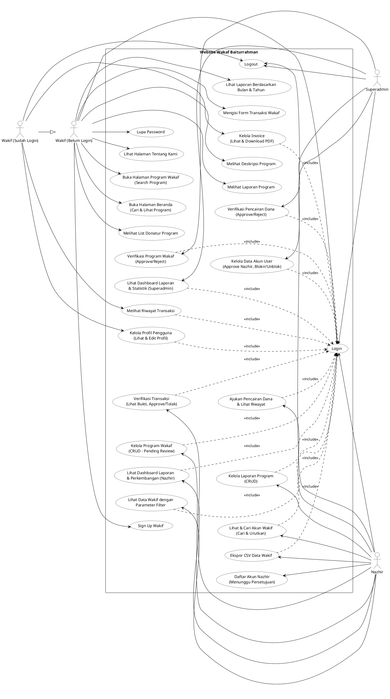
```plantuml
@startuml
left to right direction
skinparam packageStyle rectangle
skinparam monochrome false

' Colors and style configurations
skinparam actor {
    BackgroundColor white
    BorderColor black
    ArrowColor black
}

skinparam usecase {
    BackgroundColor white
    BorderColor black
    ArrowColor black
}

' --- ACTORS LEFT ---
actor "Wakif (Belum Login)" as wakif_belum
actor "Wakif (Sudah Login)" as wakif_sudah

' Generalisasi
wakif_sudah --|> wakif_belum

' --- ACTORS RIGHT ---
actor "Nazhir" as nazhir
actor "Superadmin" as superadmin

' --- SINGLE SYSTEM BOUNDARY ---
rectangle "Website Wakaf Baiturrahman" {
    
    ' --- Use Cases: Fitur Publik & Transaksi Wakif (Guest) ---
    usecase "Buka Halaman Beranda\n(Cari & Lihat Program)" as UC6
    usecase "Melihat Deskripsi Program" as UC7a
    usecase "Melihat List Donatur Program" as UC7b
    usecase "Melihat Laporan Program" as UC7c
    usecase "Buka Halaman Program Wakaf\n(Search Program)" as UC8
    usecase "Mengisi Form Transaksi Wakaf" as UC9
    usecase "Lihat Halaman Tentang Kami" as UC10
    usecase "Lihat Laporan Berdasarkan\nBulan & Tahun" as UC11
    
    ' --- Use Cases: Fitur Member (Wakif Sudah Login) ---
    usecase "Melihat Riwayat Transaksi" as UC12
    usecase "Kelola Invoice\n(Lihat & Download PDF)" as UC13
    usecase "Kelola Profil Pengguna\n(Lihat & Edit Profil)" as UC14

    ' --- Use Cases: Autentikasi & Akun ---
    usecase "Login" as login
    usecase "Logout" as logout
    usecase "Sign Up Wakif" as signup
    usecase "Daftar Akun Nazhir\n(Menunggu Persetujuan)" as signup_nazhir
    usecase "Lupa Password" as lupapass

    ' --- Use Cases: Panel Manajemen Nazhir ---
    usecase "Lihat Dashboard Laporan\n& Perkembangan (Nazhir)" as UC3
    usecase "Lihat & Cari Akun Wakif\n(Cari & Urutkan)" as UC1
    usecase "Lihat Data Wakif dengan\nParameter Filter" as UC4a
    usecase "Ekspor CSV Data Wakif" as UC4b
    usecase "Kelola Program Wakaf\n(CRUD - Pending Review)" as UC2a
    usecase "Kelola Laporan Program\n(CRUD)" as UC2b
    usecase "Verifikasi Transaksi\n(Lihat Bukti, Approve/Tolak)" as UC5
    usecase "Ajukan Pencairan Dana\n& Lihat Riwayat" as UC_pencairan_nazhir
    
    ' --- Use Cases: Panel Manajemen Superadmin ---
    usecase "Lihat Dashboard Laporan\n& Statistik (Superadmin)" as UC_dash_superadmin
    usecase "Kelola Data Akun User\n(Approve Nazhir, Blokir/Unblok)" as UC_manajemen_user
    usecase "Verifikasi Program Wakaf\n(Approve/Reject)" as UC_verifikasi_program
    usecase "Verifikasi Pencairan Dana\n(Approve/Reject)" as UC_verifikasi_pencairan

    ' --- LAYOUT GRID (2 Ovals per Row) ---
    UC6 -[hidden]down-> UC7a
    UC6 -[hidden]right-> UC7b
    UC7b -[hidden]down-> UC7c
    UC7b -[hidden]right-> UC8
    UC8 -[hidden]down-> UC9
    UC8 -[hidden]right-> UC10
    UC10 -[hidden]down-> UC11
    UC10 -[hidden]right-> UC12
    UC12 -[hidden]down-> UC13
    UC12 -[hidden]right-> UC14
    UC14 -[hidden]down-> login
    UC14 -[hidden]right-> signup
    signup -[hidden]down-> signup_nazhir
    signup -[hidden]right-> lupapass
    lupapass -[hidden]down-> logout
    lupapass -[hidden]right-> UC3
    UC3 -[hidden]down-> UC1
    UC3 -[hidden]right-> UC4a
    UC4a -[hidden]down-> UC4b
    UC4a -[hidden]right-> UC2a
    UC2a -[hidden]down-> UC2b
    UC2a -[hidden]right-> UC5
    UC5 -[hidden]down-> UC_pencairan_nazhir
    UC5 -[hidden]right-> UC_dash_superadmin
    UC_dash_superadmin -[hidden]down-> UC_manajemen_user
    UC_dash_superadmin -[hidden]right-> UC_verifikasi_program
    UC_verifikasi_program -[hidden]down-> UC_verifikasi_pencairan
}

' --- RELATIONSHIPS ---

' Wakif Belum Login Connections
wakif_belum --> UC6
wakif_belum --> UC7a
wakif_belum --> UC7b
wakif_belum --> UC7c
wakif_belum --> UC8
wakif_belum --> UC9
wakif_belum --> UC10
wakif_belum --> UC11
wakif_belum --> signup
wakif_belum --> lupapass
wakif_belum --> login

' Wakif Sudah Login Connections
wakif_sudah --> UC12
wakif_sudah --> UC13
wakif_sudah --> UC14
wakif_sudah --> logout

' Nazhir Connections (Kanan - Menggunakan <-- agar Aktor di Kanan)
login <-- nazhir
logout <-- nazhir
signup_nazhir <-- nazhir
UC1 <-- nazhir
UC2a <-- nazhir
UC2b <-- nazhir
UC3 <-- nazhir
UC4a <-- nazhir
UC4b <-- nazhir
UC5 <-- nazhir
UC_pencairan_nazhir <-- nazhir

' Superadmin Connections (Kanan - Menggunakan <-- agar Aktor di Kanan)
login <-- superadmin
logout <-- superadmin
UC_dash_superadmin <-- superadmin
UC_manajemen_user <-- superadmin
UC_verifikasi_program <-- superadmin
UC_verifikasi_pencairan <-- superadmin

' Include Relationships to Login
UC1 ..> login : <<include>>
UC2a ..> login : <<include>>
UC2b ..> login : <<include>>
UC3 ..> login : <<include>>
UC4a ..> login : <<include>>
UC4b ..> login : <<include>>
UC5 ..> login : <<include>>
UC_pencairan_nazhir ..> login : <<include>>

UC12 ..> login : <<include>>
UC13 ..> login : <<include>>
UC14 ..> login : <<include>>

UC_dash_superadmin ..> login : <<include>>
UC_manajemen_user ..> login : <<include>>
UC_verifikasi_program ..> login : <<include>>
UC_verifikasi_pencairan ..> login : <<include>>

@enduml

```

---

### 2. Diagram Hubungan Entitas (ERD)
Memetakan struktur tabel database riil (`t01` sampai `t05`) beserta relasi kunci asing (Foreign Keys).

```plantuml
@startuml
!theme plain
skinparam monochrome true
skinparam shadowing false
skinparam defaultFontName "Arial"
skinparam packageStyle rectangle

skinparam rectangle {
    BackgroundColor White
    BorderColor Black
}
skinparam usecase {
    BackgroundColor White
    BorderColor Black
}

title Diagram Hubungan Entitas (ERD) - Website Wakaf Baiturrahman

' Entitas (Rectangle)
rectangle "Peran" as Peran
rectangle "Pengguna" as Pengguna
rectangle "Program Wakaf" as Program
rectangle "Transaksi" as Transaksi
rectangle "Laporan Penyaluran" as Laporan

' Hubungan (Diamond)
diamond "Mendapatkan" as Mendapatkan
diamond "Melakukan" as Melakukan
diamond "Menerima" as Menerima
diamond "Dilaporkan" as Dilaporkan

' Atribut Peran
usecase "<u>id_role</u>" as role_id
usecase "nama_role" as role_nama
Peran -- role_id
Peran -- role_nama

' Atribut Pengguna
usecase "<u>id_user</u>" as user_id
usecase "nama" as user_nama
usecase "email" as user_email
usecase "password" as user_pw
usecase "no_hp" as user_hp
usecase "jenis_kelamin" as user_jk
usecase "alamat" as user_alamat
usecase "tanggal_lahir" as user_tgl
Pengguna -- user_id
Pengguna -- user_nama
Pengguna -- user_email
Pengguna -- user_pw
Pengguna -- user_hp
Pengguna -- user_jk
Pengguna -- user_alamat
Pengguna -- user_tgl

' Atribut Program Wakaf
usecase "<u>id_program</u>" as prog_id
usecase "nama_program" as prog_nama
usecase "deskripsi" as prog_desc
usecase "target_dana" as prog_target
usecase "dana_terkumpul" as prog_terkumpul
usecase "status_program" as prog_status
usecase "due_date" as prog_due
usecase "gambar_thumbnail" as prog_img
Program -- prog_id
Program -- prog_nama
Program -- prog_desc
Program -- prog_target
Program -- prog_terkumpul
Program -- prog_status
Program -- prog_due
Program -- prog_img

' Atribut Transaksi
usecase "<u>id_transaksi</u>" as trans_id
usecase "nominal" as trans_nominal
usecase "bukti_pembayaran" as trans_bukti
usecase "status_pembayaran" as trans_status
usecase "kode_referensi" as trans_ref
usecase "pesan_doa" as trans_doa
usecase "no_hp" as trans_hp
usecase "hide_nama" as trans_hide
Transaksi -- trans_id
Transaksi -- trans_nominal
Transaksi -- trans_bukti
Transaksi -- trans_status
Transaksi -- trans_ref
Transaksi -- trans_doa
Transaksi -- trans_hp
Transaksi -- trans_hide

' Atribut Laporan Penyaluran
usecase "<u>id_laporan</u>" as lap_id
usecase "judul_laporan" as lap_judul
usecase "keterangan" as lap_ket
usecase "dana_disalurkan" as lap_dana
usecase "penerima_manfaat" as lap_penerima
usecase "gambar_laporan" as lap_img
Laporan -- lap_id
Laporan -- lap_judul
Laporan -- lap_ket
Laporan -- lap_dana
Laporan -- lap_penerima
Laporan -- lap_img

' Hubungan Entitas dengan Kardinalitas
Peran "1" -- Mendapatkan
Mendapatkan -- "N" Pengguna

Pengguna "1" -- Melakukan
Melakukan -- "N" Transaksi

Program "1" -- Menerima
Menerima -- "N" Transaksi

Program "1" -- Dilaporkan
Dilaporkan -- "N" Laporan

@enduml
```

---

### 3. Diagram Kelas (Class Diagram)
Mengilustrasikan kelas-kelas pengguna, peran, dan entitas utama beserta atribut dan metode operasinya.

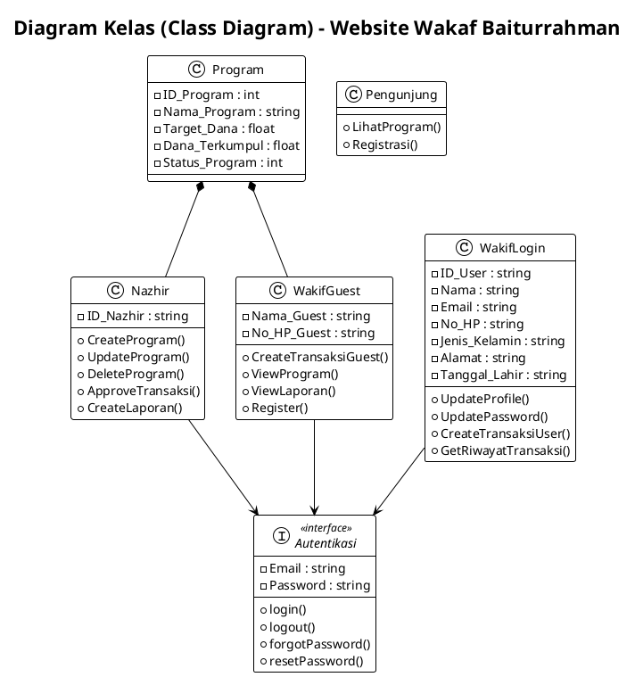
```plantuml
@startuml
!theme plain
skinparam monochrome true
skinparam shadowing false
skinparam defaultFontName "Arial"
skinparam class {
    BackgroundColor White
    BorderColor Black
    ArrowColor Black
}

title Diagram Kelas (Class Diagram) - Website Wakaf Baiturrahman

class Program {
    - ID_Program : int
    - Nama_Program : string
    - Target_Dana : float
    - Dana_Terkumpul : float
    - Status_Program : int
}

class Nazhir {
    - ID_Nazhir : string
    --
    + CreateProgram()
    + UpdateProgram()
    + DeleteProgram()
    + ApproveTransaksi()
    + CreateLaporan()
}

class WakifLogin {
    - ID_User : string
    - Nama : string
    - Email : string
    - No_HP : string
    - Jenis_Kelamin : string
    - Alamat : string
    - Tanggal_Lahir : string
    --
    + UpdateProfile()
    + UpdatePassword()
    + CreateTransaksiUser()
    + GetRiwayatTransaksi()
}

class WakifGuest {
    - Nama_Guest : string
    - No_HP_Guest : string
    --
    + CreateTransaksiGuest()
    + ViewProgram()
    + ViewLaporan()
    + Register()
}

interface Autentikasi <<interface>> {
    - Email : string
    - Password : string
    --
    + login()
    + logout()
    + forgotPassword()
    + resetPassword()
}

class Pengunjung {
    --
    + LihatProgram()
    + Registrasi()
}

' Relasi
Program *-- Nazhir
Program *-- WakifGuest

Nazhir --> Autentikasi
WakifLogin --> Autentikasi
WakifGuest --> Autentikasi

@enduml
```

---

### 4. Diagram Objek (Object Diagram)
Menampilkan snapshot contoh instansiasi data di memori runtime sistem.

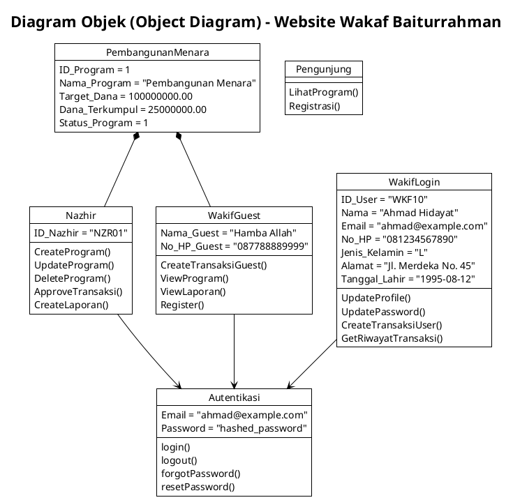
```plantuml
@startuml
!theme plain
skinparam monochrome true
skinparam shadowing false
skinparam defaultFontName "Arial"
skinparam object {
    BackgroundColor White
    BorderColor Black
    ArrowColor Black
}

title Diagram Objek (Object Diagram) - Website Wakaf Baiturrahman

object PembangunanMenara {
    ID_Program = 1
    Nama_Program = "Pembangunan Menara"
    Target_Dana = 100000000.00
    Dana_Terkumpul = 25000000.00
    Status_Program = 1
}

object Nazhir {
    ID_Nazhir = "NZR01"
    --
    CreateProgram()
    UpdateProgram()
    DeleteProgram()
    ApproveTransaksi()
    CreateLaporan()
}

object WakifLogin {
    ID_User = "WKF10"
    Nama = "Ahmad Hidayat"
    Email = "ahmad@example.com"
    No_HP = "081234567890"
    Jenis_Kelamin = "L"
    Alamat = "Jl. Merdeka No. 45"
    Tanggal_Lahir = "1995-08-12"
    --
    UpdateProfile()
    UpdatePassword()
    CreateTransaksiUser()
    GetRiwayatTransaksi()
}

object WakifGuest {
    Nama_Guest = "Hamba Allah"
    No_HP_Guest = "087788889999"
    --
    CreateTransaksiGuest()
    ViewProgram()
    ViewLaporan()
    Register()
}

object Autentikasi {
    Email = "ahmad@example.com"
    Password = "hashed_password"
    --
    login()
    logout()
    forgotPassword()
    resetPassword()
}

object Pengunjung {
    --
    LihatProgram()
    Registrasi()
}

' Relasi
PembangunanMenara *-- Nazhir
PembangunanMenara *-- WakifGuest

Nazhir --> Autentikasi
WakifLogin --> Autentikasi
WakifGuest --> Autentikasi

@enduml
```

---

### 5. Diagram Sekuen (Sequence Diagram)

#### A. Registrasi, Login & Lupa Password (Wakif)
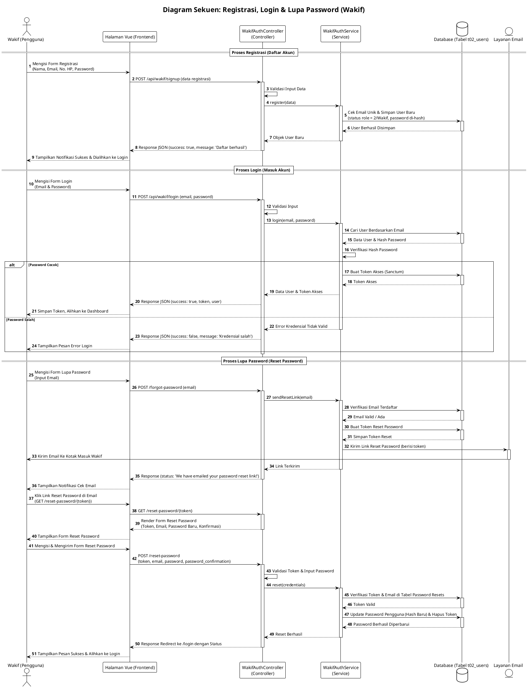
```plantuml
@startuml
!theme plain
autonumber
skinparam BoxPadding 10
skinparam ParticipantPadding 10

title Diagram Sekuen: Registrasi, Login & Lupa Password (Wakif)

actor "Wakif (Pengguna)" as wakif
participant "Halaman Vue (Frontend)" as view
participant "WakifAuthController\n(Controller)" as control
participant "WakifAuthService\n(Service)" as service
database "Database (Tabel t02_users)" as db
entity "Layanan Email" as email_svc

== Proses Registrasi (Daftar Akun) ==
wakif -> view : Mengisi Form Registrasi\n(Nama, Email, No. HP, Password)
view -> control : POST /api/wakif/signup (data registrasi)
activate control
control -> control : Validasi Input Data
control -> service : register(data)
activate service
service -> db : Cek Email Unik & Simpan User Baru\n(status role = 2/Wakif, password di-hash)
activate db
db --> service : User Berhasil Disimpan
deactivate db
service --> control : Objek User Baru
deactivate service
control --> view : Response JSON (success: true, message: 'Daftar berhasil')
deactivate control
view --> wakif : Tampilkan Notifikasi Sukses & Dialihkan ke Login

== Proses Login (Masuk Akun) ==
wakif -> view : Mengisi Form Login\n(Email & Password)
view -> control : POST /api/wakif/login (email, password)
activate control
control -> control : Validasi Input
control -> service : login(email, password)
activate service
service -> db : Cari User Berdasarkan Email
activate db
db --> service : Data User & Hash Password
deactivate db
service -> service : Verifikasi Hash Password
alt Password Cocok
    service -> db : Buat Token Akses (Sanctum)
    activate db
    db --> service : Token Akses
    deactivate db
    service --> control : Data User & Token Akses
    control --> view : Response JSON (success: true, token, user)
    view --> wakif : Simpan Token, Alihkan ke Dashboard
else Password Salah
    service --> control : Error Kredensial Tidak Valid
    deactivate service
    control --> view : Response JSON (success: false, message: 'Kredensial salah')
    view --> wakif : Tampilkan Pesan Error Login
end
deactivate control

== Proses Lupa Password (Reset Password) ==
wakif -> view : Mengisi Form Lupa Password\n(Input Email)
view -> control : POST /forgot-password (email)
activate control
control -> service : sendResetLink(email)
activate service
service -> db : Verifikasi Email Terdaftar
activate db
db --> service : Email Valid / Ada
deactivate db
service -> db : Buat Token Reset Password
activate db
db --> service : Simpan Token Reset
deactivate db
service -> email_svc : Kirim Link Reset Password (berisi token)
activate email_svc
email_svc -> wakif : Kirim Email Ke Kotak Masuk Wakif
deactivate email_svc
service --> control : Link Terkirim
deactivate service
control --> view : Response (status: 'We have emailed your password reset link!')
deactivate control
view --> wakif : Tampilkan Notifikasi Cek Email

wakif -> view : Klik Link Reset Password di Email\n(GET /reset-password/{token})
view -> control : GET /reset-password/{token}
activate control
control --> view : Render Form Reset Password\n(Token, Email, Password Baru, Konfirmasi)
deactivate control
view --> wakif : Tampilkan Form Reset Password

wakif -> view : Mengisi & Mengirim Form Reset Password
view -> control : POST /reset-password\n(token, email, password, password_confirmation)
activate control
control -> control : Validasi Token & Input Password
control -> service : reset(credentials)
activate service
service -> db : Verifikasi Token & Email di Tabel Password Resets
activate db
db --> service : Token Valid
deactivate db
service -> db : Update Password Pengguna (Hash Baru) & Hapus Token
activate db
db --> service : Password Berhasil Diperbarui
deactivate db
service --> control : Reset Berhasil
deactivate service
control --> view : Response Redirect ke /login dengan Status
deactivate control
view --> wakif : Tampilkan Pesan Sukses & Alihkan ke Login

@enduml
```

#### B. Melakukan Donasi Wakaf (Wakif Guest / Tanpa Login)
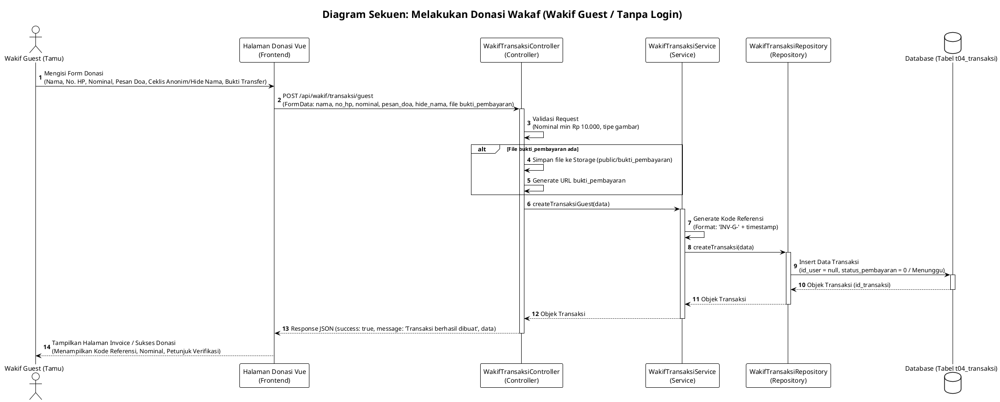
```plantuml
@startuml
!theme plain
autonumber
skinparam BoxPadding 10
skinparam ParticipantPadding 10

title Diagram Sekuen: Melakukan Donasi Wakaf (Wakif Guest / Tanpa Login)

actor "Wakif Guest (Tamu)" as guest
participant "Halaman Donasi Vue\n(Frontend)" as view
participant "WakifTransaksiController\n(Controller)" as control
participant "WakifTransaksiService\n(Service)" as service
participant "WakifTransaksiRepository\n(Repository)" as repo
database "Database (Tabel t04_transaksi)" as db

guest -> view : Mengisi Form Donasi\n(Nama, No. HP, Nominal, Pesan Doa, Ceklis Anonim/Hide Nama, Bukti Transfer)
view -> control : POST /api/wakif/transaksi/guest\n(FormData: nama, no_hp, nominal, pesan_doa, hide_nama, file bukti_pembayaran)
activate control

control -> control : Validasi Request\n(Nominal min Rp 10.000, tipe gambar)
alt File bukti_pembayaran ada
    control -> control : Simpan file ke Storage (public/bukti_pembayaran)
    control -> control : Generate URL bukti_pembayaran
end

control -> service : createTransaksiGuest(data)
activate service
service -> service : Generate Kode Referensi\n(Format: 'INV-G-' + timestamp)
service -> repo : createTransaksi(data)
activate repo

repo -> db : Insert Data Transaksi\n(id_user = null, status_pembayaran = 0 / Menunggu)
activate db
db --> repo : Objek Transaksi (id_transaksi)
deactivate db

repo --> service : Objek Transaksi
deactivate repo

service --> control : Objek Transaksi
deactivate service

control --> view : Response JSON (success: true, message: 'Transaksi berhasil dibuat', data)
deactivate control

view --> guest : Tampilkan Halaman Invoice / Sukses Donasi\n(Menampilkan Kode Referensi, Nominal, Petunjuk Verifikasi)

@enduml
```

#### C. Melakukan Donasi Wakaf (Wakif Login / Terdaftar)
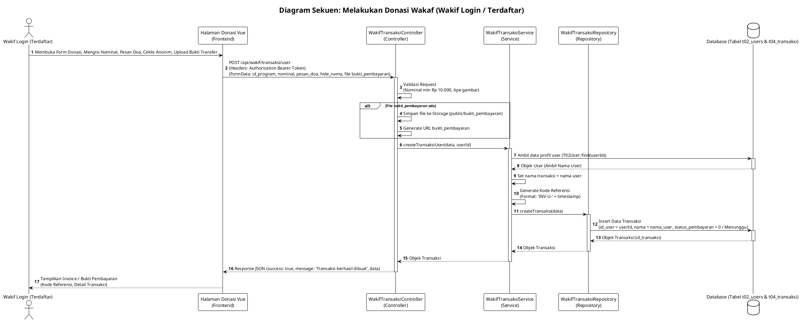
```plantuml
@startuml
!theme plain
autonumber
skinparam BoxPadding 10
skinparam ParticipantPadding 10

title Diagram Sekuen: Melakukan Donasi Wakaf (Wakif Login / Terdaftar)

actor "Wakif Login (Terdaftar)" as user
participant "Halaman Donasi Vue\n(Frontend)" as view
participant "WakifTransaksiController\n(Controller)" as control
participant "WakifTransaksiService\n(Service)" as service
participant "WakifTransaksiRepository\n(Repository)" as repo
database "Database (Tabel t02_users & t04_transaksi)" as db

user -> view : Membuka Form Donasi, Mengisi Nominal, Pesan Doa, Ceklis Anonim, Upload Bukti Transfer
view -> control : POST /api/wakif/transaksi/user\n(Headers: Authorization Bearer Token)\n(FormData: id_program, nominal, pesan_doa, hide_nama, file bukti_pembayaran)
activate control

control -> control : Validasi Request\n(Nominal min Rp 10.000, tipe gambar)
alt File bukti_pembayaran ada
    control -> control : Simpan file ke Storage (public/bukti_pembayaran)
    control -> control : Generate URL bukti_pembayaran
end

control -> service : createTransaksiUser(data, userId)
activate service

service -> db : Ambil data profil user (T02User::find(userId))
activate db
db --> service : Objek User (Ambil Nama User)
deactivate db

service -> service : Set nama transaksi = nama user
service -> service : Generate Kode Referensi\n(Format: 'INV-U-' + timestamp)

service -> repo : createTransaksi(data)
activate repo

repo -> db : Insert Data Transaksi\n(id_user = userId, nama = nama_user, status_pembayaran = 0 / Menunggu)
activate db
db --> repo : Objek Transaksi (id_transaksi)
deactivate db

repo --> service : Objek Transaksi
deactivate repo

service --> control : Objek Transaksi
deactivate service

control --> view : Response JSON (success: true, message: 'Transaksi berhasil dibuat', data)
deactivate control

view --> user : Tampilkan Invoice / Bukti Pembayaran\n(Kode Referensi, Detail Transaksi)

@enduml
```

#### D. Mengelola Program Wakaf oleh Nazhir
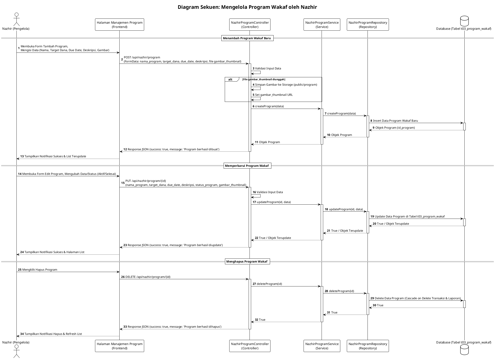
```plantuml
@startuml
!theme plain
autonumber
skinparam BoxPadding 10
skinparam ParticipantPadding 10

title Diagram Sekuen: Mengelola Program Wakaf oleh Nazhir

actor "Nazhir (Pengelola)" as nazhir
participant "Halaman Manajemen Program\n(Frontend)" as view
participant "NazhirProgramController\n(Controller)" as control
participant "NazhirProgramService\n(Service)" as service
participant "NazhirProgramRepository\n(Repository)" as repo
database "Database (Tabel t03_program_wakaf)" as db

== Menambah Program Wakaf Baru ==
nazhir -> view : Membuka Form Tambah Program,\nMengisi Data (Nama, Target Dana, Due Date, Deskripsi, Gambar)
view -> control : POST /api/nazhir/program\n(FormData: nama_program, target_dana, due_date, deskripsi, file gambar_thumbnail)
activate control
control -> control : Validasi Input Data
alt File gambar_thumbnail diunggah
    control -> control : Simpan Gambar ke Storage (public/program)
    control -> control : Set gambar_thumbnail URL
end
control -> service : createProgram(data)
activate service
service -> repo : createProgram(data)
activate repo
repo -> db : Insert Data Program Wakaf Baru
activate db
db --> repo : Objek Program (id_program)
deactivate db
repo --> service : Objek Program
deactivate repo
service --> control : Objek Program
deactivate service
control --> view : Response JSON (success: true, message: 'Program berhasil dibuat')
deactivate control
view --> nazhir : Tampilkan Notifikasi Sukses & List Terupdate

== Memperbarui Program Wakaf ==
nazhir -> view : Membuka Form Edit Program, Mengubah Data/Status (Aktif/Selesai)
view -> control : PUT /api/nazhir/program/{id}\n(nama_program, target_dana, due_date, deskripsi, status_program, gambar_thumbnail)
activate control
control -> control : Validasi Input Data
control -> service : updateProgram(id, data)
activate service
service -> repo : updateProgram(id, data)
activate repo
repo -> db : Update Data Program di Tabel t03_program_wakaf
activate db
db --> repo : True / Objek Terupdate
deactivate db
repo --> service : True / Objek Terupdate
deactivate repo
service --> control : True / Objek Terupdate
deactivate service
control --> view : Response JSON (success: true, message: 'Program berhasil diupdate')
deactivate control
view --> nazhir : Tampilkan Notifikasi Sukses & Halaman List

== Menghapus Program Wakaf ==
nazhir -> view : Mengklik Hapus Program
view -> control : DELETE /api/nazhir/program/{id}
activate control
control -> service : deleteProgram(id)
activate service
service -> repo : deleteProgram(id)
activate repo
repo -> db : Delete Data Program (Cascade on Delete Transaksi & Laporan)
activate db
db --> repo : True
deactivate db
repo --> service : True
deactivate repo
service --> control : True
deactivate service
control --> view : Response JSON (success: true, message: 'Program berhasil dihapus')
deactivate control
view --> nazhir : Tampilkan Notifikasi Hapus & Refresh List

@enduml
```

#### E. Mengelola Laporan Penyaluran oleh Nazhir
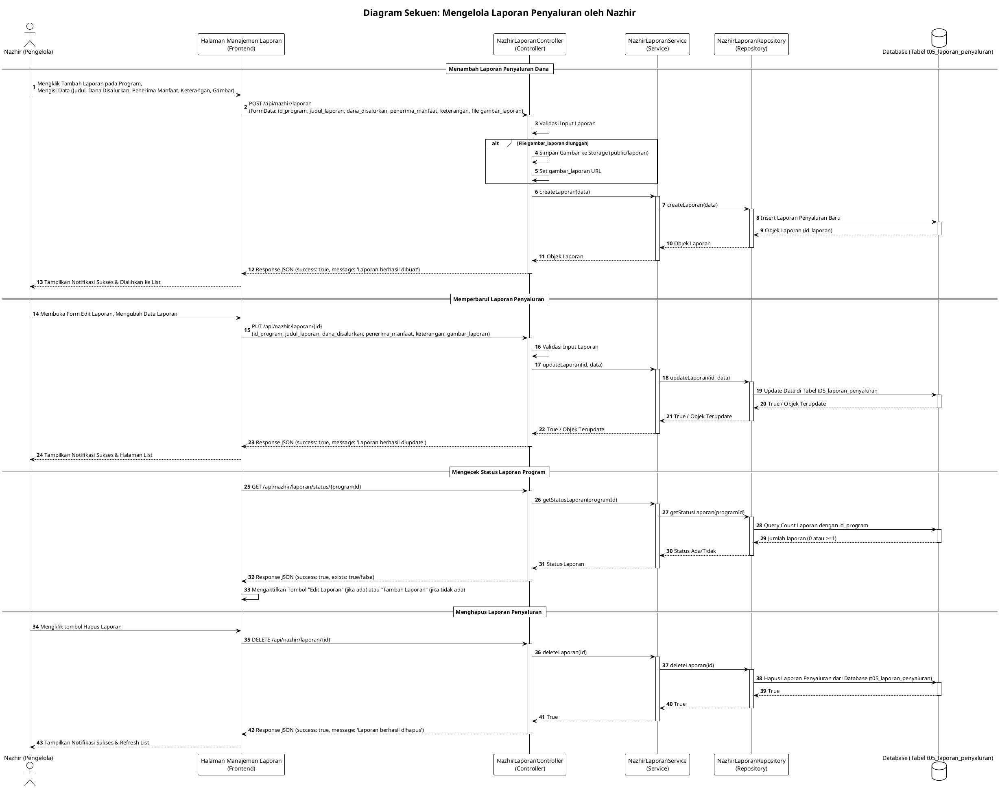
```plantuml
@startuml
!theme plain
autonumber
skinparam BoxPadding 10
skinparam ParticipantPadding 10

title Diagram Sekuen: Mengelola Laporan Penyaluran oleh Nazhir

actor "Nazhir (Pengelola)" as nazhir
participant "Halaman Manajemen Laporan\n(Frontend)" as view
participant "NazhirLaporanController\n(Controller)" as control
participant "NazhirLaporanService\n(Service)" as service
participant "NazhirLaporanRepository\n(Repository)" as repo
database "Database (Tabel t05_laporan_penyaluran)" as db

== Menambah Laporan Penyaluran Dana ==
nazhir -> view : Mengklik Tambah Laporan pada Program,\nMengisi Data (Judul, Dana Disalurkan, Penerima Manfaat, Keterangan, Gambar)
view -> control : POST /api/nazhir/laporan\n(FormData: id_program, judul_laporan, dana_disalurkan, penerima_manfaat, keterangan, file gambar_laporan)
activate control
control -> control : Validasi Input Laporan
alt File gambar_laporan diunggah
    control -> control : Simpan Gambar ke Storage (public/laporan)
    control -> control : Set gambar_laporan URL
end
control -> service : createLaporan(data)
activate service
service -> repo : createLaporan(data)
activate repo
repo -> db : Insert Laporan Penyaluran Baru
activate db
db --> repo : Objek Laporan (id_laporan)
deactivate db
repo --> service : Objek Laporan
deactivate repo
service --> control : Objek Laporan
deactivate service
control --> view : Response JSON (success: true, message: 'Laporan berhasil dibuat')
deactivate control
view --> nazhir : Tampilkan Notifikasi Sukses & Dialihkan ke List

== Memperbarui Laporan Penyaluran ==
nazhir -> view : Membuka Form Edit Laporan, Mengubah Data Laporan
view -> control : PUT /api/nazhir/laporan/{id}\n(id_program, judul_laporan, dana_disalurkan, penerima_manfaat, keterangan, gambar_laporan)
activate control
control -> control : Validasi Input Laporan
control -> service : updateLaporan(id, data)
activate service
service -> repo : updateLaporan(id, data)
activate repo
repo -> db : Update Data di Tabel t05_laporan_penyaluran
activate db
db --> repo : True / Objek Terupdate
deactivate db
repo --> service : True / Objek Terupdate
deactivate repo
service --> control : True / Objek Terupdate
deactivate service
control --> view : Response JSON (success: true, message: 'Laporan berhasil diupdate')
deactivate control
view --> nazhir : Tampilkan Notifikasi Sukses & Halaman List

== Mengecek Status Laporan Program ==
view -> control : GET /api/nazhir/laporan/status/{programId}
activate control
control -> service : getStatusLaporan(programId)
activate service
service -> repo : getStatusLaporan(programId)
activate repo
repo -> db : Query Count Laporan dengan id_program
activate db
db --> repo : Jumlah laporan (0 atau >=1)
deactivate db
repo --> service : Status Ada/Tidak
deactivate repo
service --> control : Status Laporan
deactivate service
control --> view : Response JSON (success: true, exists: true/false)
deactivate control
view -> view : Mengaktifkan Tombol "Edit Laporan" (jika ada) atau "Tambah Laporan" (jika tidak ada)

== Menghapus Laporan Penyaluran ==
nazhir -> view : Mengklik tombol Hapus Laporan
view -> control : DELETE /api/nazhir/laporan/{id}
activate control
control -> service : deleteLaporan(id)
activate service
service -> repo : deleteLaporan(id)
activate repo
repo -> db : Hapus Laporan Penyaluran dari Database (t05_laporan_penyaluran)
activate db
db --> repo : True
deactivate db
repo --> service : True
deactivate repo
service --> control : True
deactivate service
control --> view : Response JSON (success: true, message: 'Laporan berhasil dihapus')
deactivate control
view --> nazhir : Tampilkan Notifikasi Sukses & Refresh List

@enduml
```

#### F. Verifikasi Pembayaran Transaksi oleh Nazhir
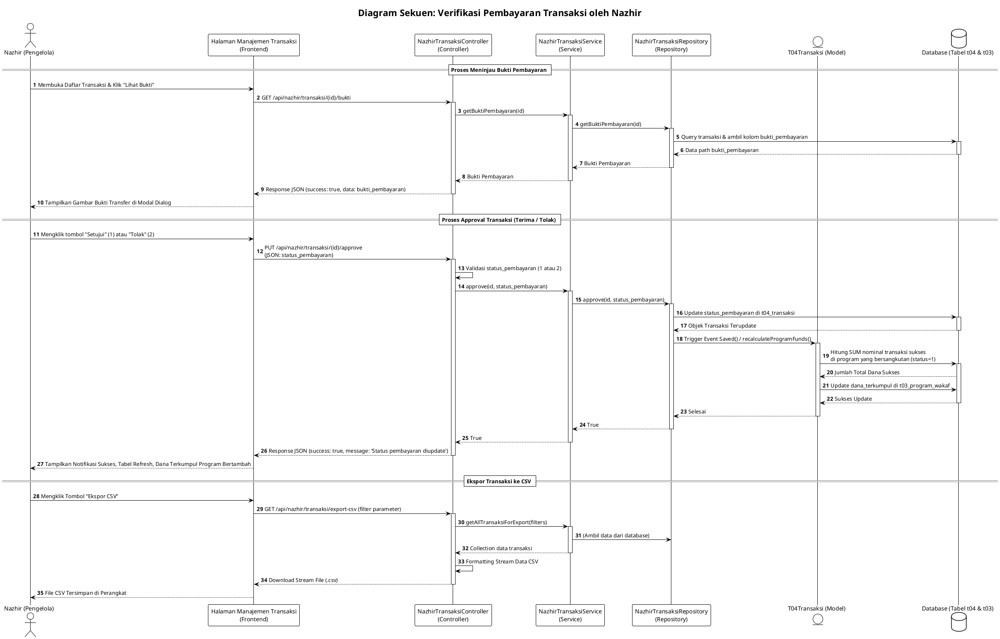
```plantuml
@startuml
!theme plain
autonumber
skinparam BoxPadding 10
skinparam ParticipantPadding 10

title Diagram Sekuen: Verifikasi Pembayaran Transaksi oleh Nazhir

actor "Nazhir (Pengelola)" as nazhir
participant "Halaman Manajemen Transaksi\n(Frontend)" as view
participant "NazhirTransaksiController\n(Controller)" as control
participant "NazhirTransaksiService\n(Service)" as service
participant "NazhirTransaksiRepository\n(Repository)" as repo
entity "T04Transaksi (Model)" as model
database "Database (Tabel t04 & t03)" as db

== Proses Meninjau Bukti Pembayaran ==
nazhir -> view : Membuka Daftar Transaksi & Klik "Lihat Bukti"
view -> control : GET /api/nazhir/transaksi/{id}/bukti
activate control
control -> service : getBuktiPembayaran(id)
activate service
service -> repo : getBuktiPembayaran(id)
activate repo
repo -> db : Query transaksi & ambil kolom bukti_pembayaran
activate db
db --> repo : Data path bukti_pembayaran
deactivate db
repo --> service : Bukti Pembayaran
deactivate repo
service --> control : Bukti Pembayaran
deactivate service
control --> view : Response JSON (success: true, data: bukti_pembayaran)
deactivate control
view --> nazhir : Tampilkan Gambar Bukti Transfer di Modal Dialog

== Proses Approval Transaksi (Terima / Tolak) ==
nazhir -> view : Mengklik tombol "Setujui" (1) atau "Tolak" (2)
view -> control : PUT /api/nazhir/transaksi/{id}/approve\n(JSON: status_pembayaran)
activate control
control -> control : Validasi status_pembayaran (1 atau 2)
control -> service : approve(id, status_pembayaran)
activate service
service -> repo : approve(id, status_pembayaran)
activate repo
repo -> db : Update status_pembayaran di t04_transaksi
activate db
db --> repo : Objek Transaksi Terupdate
deactivate db

repo -> model : Trigger Event Saved() / recalculateProgramFunds()
activate model
model -> db : Hitung SUM nominal transaksi sukses\ndi program yang bersangkutan (status=1)
activate db
db --> model : Jumlah Total Dana Sukses
model -> db : Update dana_terkumpul di t03_program_wakaf
db --> model : Sukses Update
deactivate db
model --> repo : Selesai
deactivate model

repo --> service : True
deactivate repo
service --> control : True
deactivate service
control --> view : Response JSON (success: true, message: 'Status pembayaran diupdate')
deactivate control
view --> nazhir : Tampilkan Notifikasi Sukses, Tabel Refresh, Dana Terkumpul Program Bertambah

== Ekspor Transaksi ke CSV ==
nazhir -> view : Mengklik Tombol "Ekspor CSV"
view -> control : GET /api/nazhir/transaksi/export-csv (filter parameter)
activate control
control -> service : getAllTransaksiForExport(filters)
activate service
service -> repo : (Ambil data dari database)
service --> control : Collection data transaksi
deactivate service
control -> control : Formatting Stream Data CSV
control --> view : Download Stream File (.csv)
deactivate control
view --> nazhir : File CSV Tersimpan di Perangkat

@enduml
```

#### G. Manajemen Profil & Riwayat Transaksi (Wakif Login)
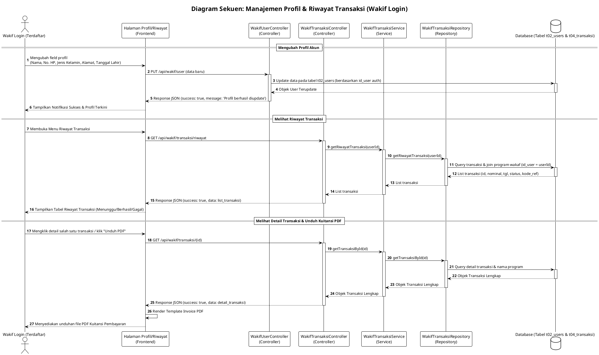
```plantuml
@startuml
!theme plain
autonumber
skinparam BoxPadding 10
skinparam ParticipantPadding 10

title Diagram Sekuen: Manajemen Profil & Riwayat Transaksi (Wakif Login)

actor "Wakif Login (Terdaftar)" as user
participant "Halaman Profil/Riwayat\n(Frontend)" as view
participant "WakifUserController\n(Controller)" as u_control
participant "WakifTransaksiController\n(Controller)" as t_control
participant "WakifTransaksiService\n(Service)" as service
participant "WakifTransaksiRepository\n(Repository)" as repo
database "Database (Tabel t02_users & t04_transaksi)" as db

== Mengubah Profil Akun ==
user -> view : Mengubah field profil\n(Nama, No. HP, Jenis Kelamin, Alamat, Tanggal Lahir)
view -> u_control : PUT /api/wakif/user (data baru)
activate u_control
u_control -> db : Update data pada tabel t02_users (berdasarkan id_user auth)
activate db
db --> u_control : Objek User Terupdate
deactivate db
u_control --> view : Response JSON (success: true, message: 'Profil berhasil diupdate')
deactivate u_control
view --> user : Tampilkan Notifikasi Sukses & Profil Terkini

== Melihat Riwayat Transaksi ==
user -> view : Membuka Menu Riwayat Transaksi
view -> t_control : GET /api/wakif/transaksi/riwayat
activate t_control
t_control -> service : getRiwayatTransaksi(userId)
activate service
service -> repo : getRiwayatTransaksi(userId)
activate repo
repo -> db : Query transaksi & join program wakaf (id_user = userId)
activate db
db --> repo : List transaksi (id, nominal, tgl, status, kode_ref)
deactivate db
repo --> service : List transaksi
deactivate repo
service --> t_control : List transaksi
deactivate service
t_control --> view : Response JSON (success: true, data: list_transaksi)
deactivate t_control
view --> user : Tampilkan Tabel Riwayat Transaksi (Menunggu/Berhasil/Gagal)

== Melihat Detail Transaksi & Unduh Kuitansi PDF ==
user -> view : Mengklik detail salah satu transaksi / klik "Unduh PDF"
view -> t_control : GET /api/wakif/transaksi/{id}
activate t_control
t_control -> service : getTransaksiById(id)
activate service
service -> repo : getTransaksiById(id)
activate repo
repo -> db : Query detail transaksi & nama program
activate db
db --> repo : Objek Transaksi Lengkap
deactivate db
repo --> service : Objek Transaksi Lengkap
deactivate repo
service --> t_control : Objek Transaksi Lengkap
deactivate service
t_control --> view : Response JSON (success: true, data: detail_transaksi)
deactivate t_control
view -> view : Render Template Invoice PDF
view --> user : Menyediakan unduhan file PDF Kuitansi Pembayaran

@enduml
```

#### H. Penelusuran Halaman & Program (Wakif)
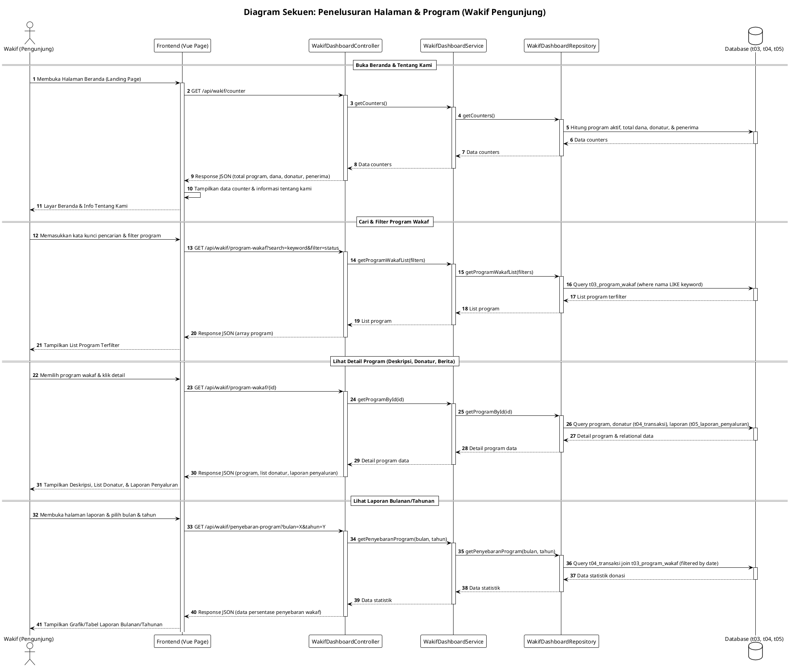
```plantuml
@startuml
!theme plain
autonumber
skinparam BoxPadding 10
skinparam ParticipantPadding 10

title Diagram Sekuen: Penelusuran Halaman & Program (Wakif Pengunjung)

actor "Wakif (Pengunjung)" as wakif
participant "Frontend (Vue Page)" as view
participant "WakifDashboardController" as control
participant "WakifDashboardService" as service
participant "WakifDashboardRepository" as repo
database "Database (t03, t04, t05)" as db

== Buka Beranda & Tentang Kami ==
wakif -> view : Membuka Halaman Beranda (Landing Page)
activate view
view -> control : GET /api/wakif/counter
activate control
control -> service : getCounters()
activate service
service -> repo : getCounters()
activate repo
repo -> db : Hitung program aktif, total dana, donatur, & penerima
activate db
db --> repo : Data counters
deactivate db
repo --> service : Data counters
deactivate repo
service --> control : Data counters
deactivate service
control --> view : Response JSON (total program, dana, donatur, penerima)
deactivate control
view -> view : Tampilkan data counter & informasi tentang kami
view --> wakif : Layar Beranda & Info Tentang Kami

== Cari & Filter Program Wakaf ==
wakif -> view : Memasukkan kata kunci pencarian & filter program
view -> control : GET /api/wakif/program-wakaf?search=keyword&filter=status
activate control
control -> service : getProgramWakafList(filters)
activate service
service -> repo : getProgramWakafList(filters)
activate repo
repo -> db : Query t03_program_wakaf (where nama LIKE keyword)
activate db
db --> repo : List program terfilter
deactivate db
repo --> service : List program
deactivate repo
service --> control : List program
deactivate service
control --> view : Response JSON (array program)
deactivate control
view --> wakif : Tampilkan List Program Terfilter

== Lihat Detail Program (Deskripsi, Donatur, Berita) ==
wakif -> view : Memilih program wakaf & klik detail
view -> control : GET /api/wakif/program-wakaf/{id}
activate control
control -> service : getProgramById(id)
activate service
service -> repo : getProgramById(id)
activate repo
repo -> db : Query program, donatur (t04_transaksi), laporan (t05_laporan_penyaluran)
activate db
db --> repo : Detail program & relational data
deactivate db
repo --> service : Detail program data
deactivate repo
service --> control : Detail program data
deactivate service
control --> view : Response JSON (program, list donatur, laporan penyaluran)
deactivate control
view --> wakif : Tampilkan Deskripsi, List Donatur, & Laporan Penyaluran

== Lihat Laporan Bulanan/Tahunan ==
wakif -> view : Membuka halaman laporan & pilih bulan & tahun
view -> control : GET /api/wakif/penyebaran-program?bulan=X&tahun=Y
activate control
control -> service : getPenyebaranProgram(bulan, tahun)
activate service
service -> repo : getPenyebaranProgram(bulan, tahun)
activate repo
repo -> db : Query t04_transaksi join t03_program_wakaf (filtered by date)
activate db
db --> repo : Data statistik donasi
deactivate db
repo --> service : Data statistik
deactivate repo
service --> control : Data statistik
deactivate service
control --> view : Response JSON (data persentase penyebaran wakaf)
deactivate control
view --> wakif : Tampilkan Grafik/Tabel Laporan Bulanan/Tahunan

@enduml
```

#### I. Dashboard Perkembangan & Manajemen User oleh Nazhir
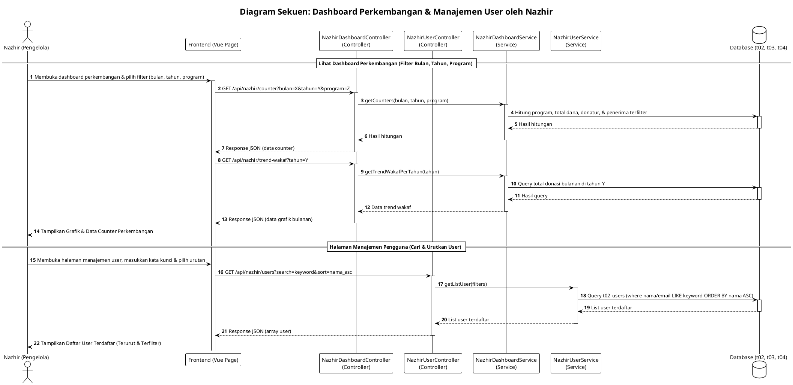
```plantuml
@startuml
!theme plain
autonumber
skinparam BoxPadding 10
skinparam ParticipantPadding 10

title Diagram Sekuen: Dashboard Perkembangan & Manajemen User oleh Nazhir

actor "Nazhir (Pengelola)" as nazhir
participant "Frontend (Vue Page)" as view
participant "NazhirDashboardController\n(Controller)" as dash_ctrl
participant "NazhirUserController\n(Controller)" as user_ctrl
participant "NazhirDashboardService\n(Service)" as dash_svc
participant "NazhirUserService\n(Service)" as user_svc
database "Database (t02, t03, t04)" as db

== Lihat Dashboard Perkembangan (Filter Bulan, Tahun, Program) ==
nazhir -> view : Membuka dashboard perkembangan & pilih filter (bulan, tahun, program)
activate view
view -> dash_ctrl : GET /api/nazhir/counter?bulan=X&tahun=Y&program=Z
activate dash_ctrl
dash_ctrl -> dash_svc : getCounters(bulan, tahun, program)
activate dash_svc
dash_svc -> db : Hitung program, total dana, donatur, & penerima terfilter
activate db
db --> dash_svc : Hasil hitungan
deactivate db
dash_svc --> dash_ctrl : Hasil hitungan
deactivate dash_svc
dash_ctrl --> view : Response JSON (data counter)
deactivate dash_ctrl

view -> dash_ctrl : GET /api/nazhir/trend-wakaf?tahun=Y
activate dash_ctrl
dash_ctrl -> dash_svc : getTrendWakafPerTahun(tahun)
activate dash_svc
dash_svc -> db : Query total donasi bulanan di tahun Y
activate db
db --> dash_svc : Hasil query
deactivate db
dash_svc --> dash_ctrl : Data trend wakaf
deactivate dash_svc
dash_ctrl --> view : Response JSON (data grafik bulanan)
deactivate dash_ctrl

view --> nazhir : Tampilkan Grafik & Data Counter Perkembangan

== Halaman Manajemen Pengguna (Cari & Urutkan User) ==
nazhir -> view : Membuka halaman manajemen user, masukkan kata kunci & pilih urutan
view -> user_ctrl : GET /api/nazhir/users?search=keyword&sort=nama_asc
activate user_ctrl
user_ctrl -> user_svc : getListUser(filters)
activate user_svc
user_svc -> db : Query t02_users (where nama/email LIKE keyword ORDER BY nama ASC)
activate db
db --> user_svc : List user terdaftar
deactivate db
user_svc --> user_ctrl : List user terdaftar
deactivate user_svc
user_ctrl --> view : Response JSON (array user)
deactivate user_ctrl
view --> nazhir : Tampilkan Daftar User Terdaftar (Terurut & Terfilter)

@enduml
```

---

### 6. Diagram Aktivitas (Activity Diagram)

#### A. Registrasi, Login & Lupa Password
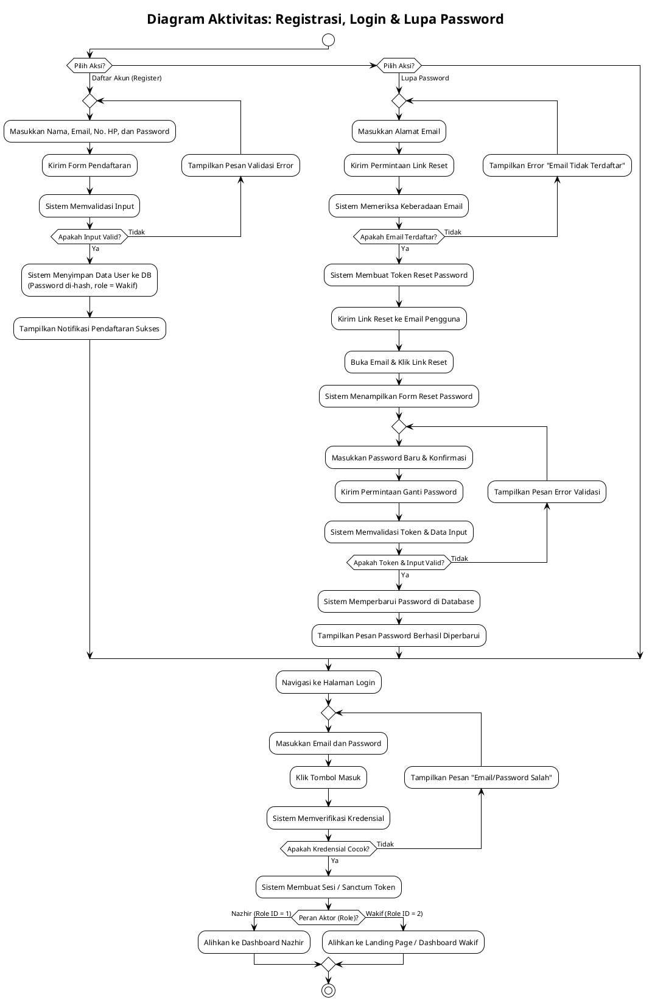
```plantuml
@startuml
!theme plain

title Diagram Aktivitas: Registrasi, Login & Lupa Password

start

if (Pilih Aksi?) then (Daftar Akun (Register))
    repeat
        :Masukkan Nama, Email, No. HP, dan Password;
        :Kirim Form Pendaftaran;
        :Sistem Memvalidasi Input;
    backward:Tampilkan Pesan Validasi Error;
    repeat while (Apakah Input Valid?) is (Tidak) not (Ya)
    :Sistem Menyimpan Data User ke DB\n(Password di-hash, role = Wakif);
    :Tampilkan Notifikasi Pendaftaran Sukses;
    
else if (Pilih Aksi?) then (Lupa Password)
    repeat
        :Masukkan Alamat Email;
        :Kirim Permintaan Link Reset;
        :Sistem Memeriksa Keberadaan Email;
    backward:Tampilkan Error "Email Tidak Terdaftar";
    repeat while (Apakah Email Terdaftar?) is (Tidak) not (Ya)
    :Sistem Membuat Token Reset Password;
    :Kirim Link Reset ke Email Pengguna;
    :Buka Email & Klik Link Reset;
    :Sistem Menampilkan Form Reset Password;
    repeat
        :Masukkan Password Baru & Konfirmasi;
        :Kirim Permintaan Ganti Password;
        :Sistem Memvalidasi Token & Data Input;
    backward:Tampilkan Pesan Error Validasi;
    repeat while (Apakah Token & Input Valid?) is (Tidak) not (Ya)
    :Sistem Memperbarui Password di Database;
    :Tampilkan Pesan Password Berhasil Diperbarui;
endif

:Navigasi ke Halaman Login;
repeat
    :Masukkan Email dan Password;
    :Klik Tombol Masuk;
    :Sistem Memverifikasi Kredensial;
backward:Tampilkan Pesan "Email/Password Salah";
repeat while (Apakah Kredensial Cocok?) is (Tidak) not (Ya)

:Sistem Membuat Sesi / Sanctum Token;
if (Peran Aktor (Role)?) then (Nazhir (Role ID = 1))
    :Alihkan ke Dashboard Nazhir;
else (Wakif (Role ID = 2))
    :Alihkan ke Landing Page / Dashboard Wakif;
endif

stop
@enduml
```

#### B. Transaksi Donasi Wakaf
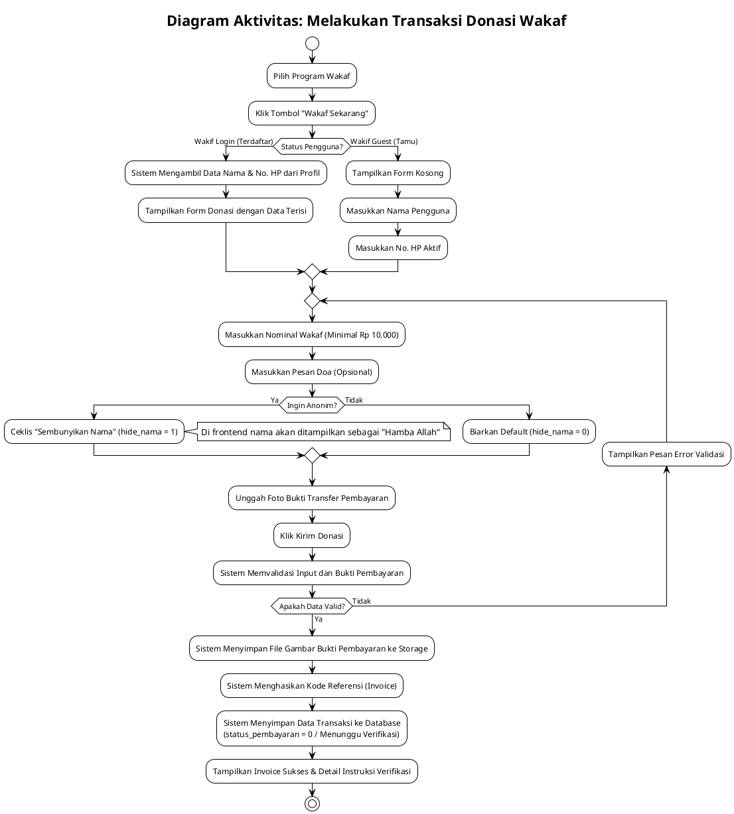
```plantuml
@startuml
!theme plain

title Diagram Aktivitas: Melakukan Transaksi Donasi Wakaf

start

:Pilih Program Wakaf;
:Klik Tombol "Wakaf Sekarang";

if (Status Pengguna?) then (Wakif Login (Terdaftar))
    :Sistem Mengambil Data Nama & No. HP dari Profil;
    :Tampilkan Form Donasi dengan Data Terisi;
else (Wakif Guest (Tamu))
    :Tampilkan Form Kosong;
    :Masukkan Nama Pengguna;
    :Masukkan No. HP Aktif;
endif

repeat
    :Masukkan Nominal Wakaf (Minimal Rp 10.000);
    :Masukkan Pesan Doa (Opsional);
    if (Ingin Anonim?) then (Ya)
        :Ceklis "Sembunyikan Nama" (hide_nama = 1);
        note right: Di frontend nama akan ditampilkan sebagai "Hamba Allah"
    else (Tidak)
        :Biarkan Default (hide_nama = 0);
    endif
    :Unggah Foto Bukti Transfer Pembayaran;
    :Klik Kirim Donasi;
    :Sistem Memvalidasi Input dan Bukti Pembayaran;
backward:Tampilkan Pesan Error Validasi;
repeat while (Apakah Data Valid?) is (Tidak) not (Ya)

:Sistem Menyimpan File Gambar Bukti Pembayaran ke Storage;
:Sistem Menghasikan Kode Referensi (Invoice);
:Sistem Menyimpan Data Transaksi ke Database\n(status_pembayaran = 0 / Menunggu Verifikasi);
:Tampilkan Invoice Sukses & Detail Instruksi Verifikasi;

stop
@enduml
```

#### C. Mengelola Program Wakaf oleh Nazhir
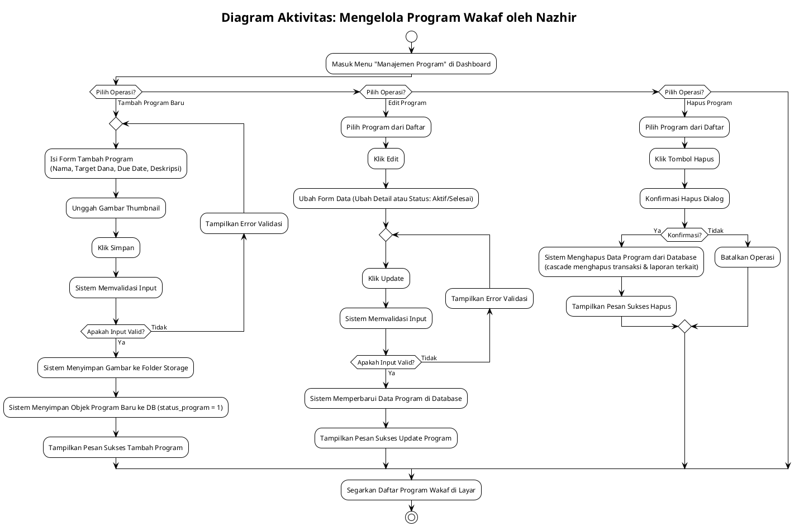
```plantuml
@startuml
!theme plain

title Diagram Aktivitas: Mengelola Program Wakaf oleh Nazhir

start

:Masuk Menu "Manajemen Program" di Dashboard;

if (Pilih Operasi?) then (Tambah Program Baru)
    repeat
        :Isi Form Tambah Program\n(Nama, Target Dana, Due Date, Deskripsi);
        :Unggah Gambar Thumbnail;
        :Klik Simpan;
        :Sistem Memvalidasi Input;
    backward:Tampilkan Error Validasi;
    repeat while (Apakah Input Valid?) is (Tidak) not (Ya)
    :Sistem Menyimpan Gambar ke Folder Storage;
    :Sistem Menyimpan Objek Program Baru ke DB (status_program = 1);
    :Tampilkan Pesan Sukses Tambah Program;

else if (Pilih Operasi?) then (Edit Program)
    :Pilih Program dari Daftar;
    :Klik Edit;
    :Ubah Form Data (Ubah Detail atau Status: Aktif/Selesai);
    repeat
        :Klik Update;
        :Sistem Memvalidasi Input;
    backward:Tampilkan Error Validasi;
    repeat while (Apakah Input Valid?) is (Tidak) not (Ya)
    :Sistem Memperbarui Data Program di Database;
    :Tampilkan Pesan Sukses Update Program;

else if (Pilih Operasi?) then (Hapus Program)
    :Pilih Program dari Daftar;
    :Klik Tombol Hapus;
    :Konfirmasi Hapus Dialog;
    if (Konfirmasi?) then (Ya)
        :Sistem Menghapus Data Program dari Database\n(cascade menghapus transaksi & laporan terkait);
        :Tampilkan Pesan Sukses Hapus;
    else (Tidak)
        :Batalkan Operasi;
    endif
endif

:Segarkan Daftar Program Wakaf di Layar;
stop
@enduml
```

#### D. Mengelola Laporan Penyaluran oleh Nazhir
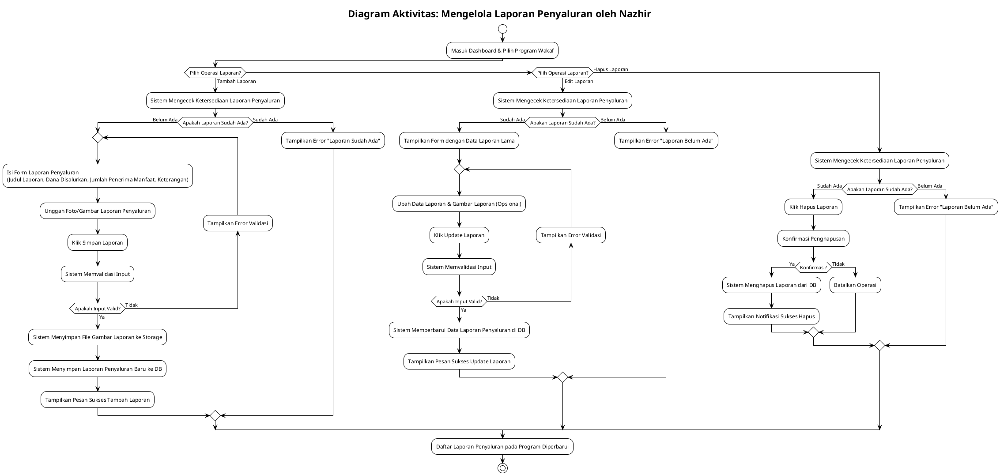
```plantuml
@startuml
!theme plain

title Diagram Aktivitas: Mengelola Laporan Penyaluran oleh Nazhir

start

:Masuk Dashboard & Pilih Program Wakaf;

if (Pilih Operasi Laporan?) then (Tambah Laporan)
    :Sistem Mengecek Ketersediaan Laporan Penyaluran;
    if (Apakah Laporan Sudah Ada?) then (Belum Ada)
        repeat
            :Isi Form Laporan Penyaluran\n(Judul Laporan, Dana Disalurkan, Jumlah Penerima Manfaat, Keterangan);
            :Unggah Foto/Gambar Laporan Penyaluran;
            :Klik Simpan Laporan;
            :Sistem Memvalidasi Input;
        backward:Tampilkan Error Validasi;
        repeat while (Apakah Input Valid?) is (Tidak) not (Ya)
        :Sistem Menyimpan File Gambar Laporan ke Storage;
        :Sistem Menyimpan Laporan Penyaluran Baru ke DB;
        :Tampilkan Pesan Sukses Tambah Laporan;
    else (Sudah Ada)
        :Tampilkan Error "Laporan Sudah Ada";
    endif
    
else if (Pilih Operasi Laporan?) then (Edit Laporan)
    :Sistem Mengecek Ketersediaan Laporan Penyaluran;
    if (Apakah Laporan Sudah Ada?) then (Sudah Ada)
        :Tampilkan Form dengan Data Laporan Lama;
        repeat
            :Ubah Data Laporan & Gambar Laporan (Opsional);
            :Klik Update Laporan;
            :Sistem Memvalidasi Input;
        backward:Tampilkan Error Validasi;
        repeat while (Apakah Input Valid?) is (Tidak) not (Ya)
        :Sistem Memperbarui Data Laporan Penyaluran di DB;
        :Tampilkan Pesan Sukses Update Laporan;
    else (Belum Ada)
        :Tampilkan Error "Laporan Belum Ada";
    endif

else (Hapus Laporan)
    :Sistem Mengecek Ketersediaan Laporan Penyaluran;
    if (Apakah Laporan Sudah Ada?) then (Sudah Ada)
        :Klik Hapus Laporan;
        :Konfirmasi Penghapusan;
        if (Konfirmasi?) then (Ya)
            :Sistem Menghapus Laporan dari DB;
            :Tampilkan Notifikasi Sukses Hapus;
        else (Tidak)
            :Batalkan Operasi;
        endif
    else (Belum Ada)
        :Tampilkan Error "Laporan Belum Ada";
    endif
endif

:Daftar Laporan Penyaluran pada Program Diperbarui;
stop
@enduml
```

#### E. Verifikasi & Approval Transaksi oleh Nazhir
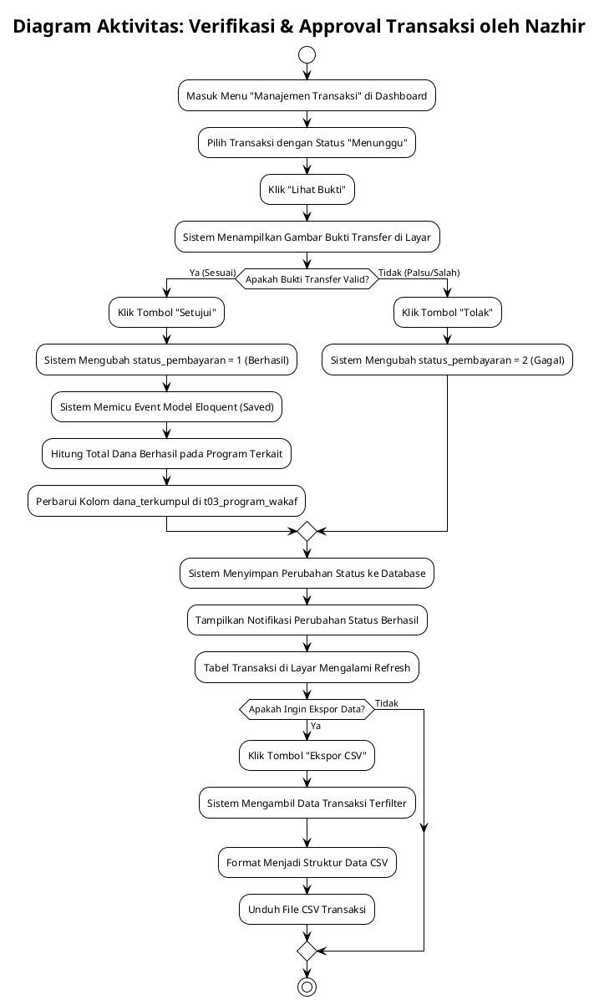
```plantuml
@startuml
!theme plain

title Diagram Aktivitas: Verifikasi & Approval Transaksi oleh Nazhir

start

:Masuk Menu "Manajemen Transaksi" di Dashboard;
:Pilih Transaksi dengan Status "Menunggu";
:Klik "Lihat Bukti";
:Sistem Menampilkan Gambar Bukti Transfer di Layar;

if (Apakah Bukti Transfer Valid?) then (Ya (Sesuai))
    :Klik Tombol "Setujui";
    :Sistem Mengubah status_pembayaran = 1 (Berhasil);
    :Sistem Memicu Event Model Eloquent (Saved);
    :Hitung Total Dana Berhasil pada Program Terkait;
    :Perbarui Kolom dana_terkumpul di t03_program_wakaf;
else (Tidak (Palsu/Salah))
    :Klik Tombol "Tolak";
    :Sistem Mengubah status_pembayaran = 2 (Gagal);
endif

:Sistem Menyimpan Perubahan Status ke Database;
:Tampilkan Notifikasi Perubahan Status Berhasil;
:Tabel Transaksi di Layar Mengalami Refresh;

if (Apakah Ingin Ekspor Data?) then (Ya)
    :Klik Tombol "Ekspor CSV";
    :Sistem Mengambil Data Transaksi Terfilter;
    :Format Menjadi Struktur Data CSV;
    :Unduh File CSV Transaksi;
else (Tidak)
endif

stop
@enduml
```

#### F. Profil & Riwayat Transaksi (Wakif Login)
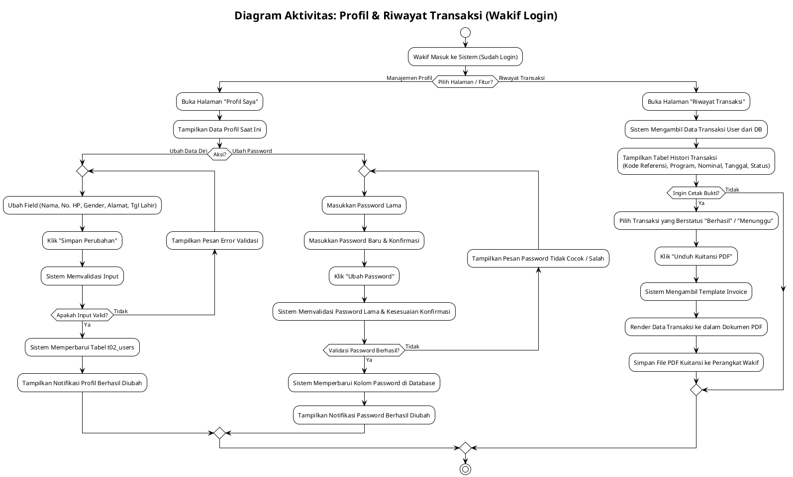
```plantuml
@startuml
!theme plain

title Diagram Aktivitas: Profil & Riwayat Transaksi (Wakif Login)

start

:Wakif Masuk ke Sistem (Sudah Login);

if (Pilih Halaman / Fitur?) then (Manajemen Profil)
    :Buka Halaman "Profil Saya";
    :Tampilkan Data Profil Saat Ini;
    if (Aksi?) then (Ubah Data Diri)
        repeat
            :Ubah Field (Nama, No. HP, Gender, Alamat, Tgl Lahir);
            :Klik "Simpan Perubahan";
            :Sistem Memvalidasi Input;
        backward:Tampilkan Pesan Error Validasi;
        repeat while (Apakah Input Valid?) is (Tidak) not (Ya)
        :Sistem Memperbarui Tabel t02_users;
        :Tampilkan Notifikasi Profil Berhasil Diubah;
    else (Ubah Password)
        repeat
            :Masukkan Password Lama;
            :Masukkan Password Baru & Konfirmasi;
            :Klik "Ubah Password";
            :Sistem Memvalidasi Password Lama & Kesesuaian Konfirmasi;
        backward:Tampilkan Pesan Password Tidak Cocok / Salah;
        repeat while (Validasi Password Berhasil?) is (Tidak) not (Ya)
        :Sistem Memperbarui Kolom Password di Database;
        :Tampilkan Notifikasi Password Berhasil Diubah;
    endif

else (Riwayat Transaksi)
    :Buka Halaman "Riwayat Transaksi";
    :Sistem Mengambil Data Transaksi User dari DB;
    :Tampilkan Tabel Histori Transaksi\n(Kode Referensi, Program, Nominal, Tanggal, Status);
    if (Ingin Cetak Bukti?) then (Ya)
        :Pilih Transaksi yang Berstatus "Berhasil" / "Menunggu";
        :Klik "Unduh Kuitansi PDF";
        :Sistem Mengambil Template Invoice;
        :Render Data Transaksi ke dalam Dokumen PDF;
        :Simpan File PDF Kuitansi ke Perangkat Wakif;
    else (Tidak)
    endif
endif

stop
@enduml
```

#### G. Penelusuran Halaman & Program (Wakif)
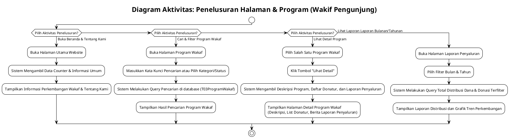
```plantuml
@startuml
!theme plain

title Diagram Aktivitas: Penelusuran Halaman & Program (Wakif Pengunjung)

start

if (Pilih Aktivitas Penelusuran?) then (Buka Beranda & Tentang Kami)
    :Buka Halaman Utama Website;
    :Sistem Mengambil Data Counter & Informasi Umum;
    :Tampilkan Informasi Perkembangan Wakaf & Tentang Kami;
    
else if (Pilih Aktivitas Penelusuran?) then (Cari & Filter Program Wakaf)
    :Buka Halaman Program Wakaf;
    :Masukkan Kata Kunci Pencarian atau Pilih Kategori/Status;
    :Sistem Melakukan Query Pencarian di database (T03ProgramWakaf);
    :Tampilkan Hasil Pencarian Program Wakaf;
    
else if (Pilih Aktivitas Penelusuran?) then (Lihat Detail Program)
    :Pilih Salah Satu Program Wakaf;
    :Klik Tombol "Lihat Detail";
    :Sistem Mengambil Deskripsi Program, Daftar Donatur, dan Laporan Penyaluran;
    :Tampilkan Halaman Detail Program Wakaf\n(Deskripsi, List Donatur, Berita Laporan Penyaluran);
    
else (Lihat Laporan Laporan Bulanan/Tahunan)
    :Buka Halaman Laporan Penyaluran;
    :Pilih Filter Bulan & Tahun;
    :Sistem Melakukan Query Total Distribusi Dana & Donasi Terfilter;
    :Tampilkan Laporan Distribusi dan Grafik Tren Perkembangan;
endif

stop
@enduml
```

#### H. Dashboard & Manajemen User oleh Nazhir
```plantuml
@startuml
!theme plain

title Diagram Aktivitas: Dashboard & Manajemen User oleh Nazhir

start

:Nazhir Masuk Halaman Admin (Sudah Login);

if (Pilih Menu Admin?) then (Lihat Dashboard Laporan & Perkembangan)
    :Buka Halaman Dashboard Utama;
    :Pilih Filter Bulan, Tahun, atau Program Wakaf;
    :Sistem Melakukan Query Data Keuangan & Statistik;
    :Tampilkan Total Program, Total Donatur, Dana Terkumpul, & Grafik Tren;

else (Manajemen Pengguna)
    :Buka Halaman Manajemen User;
    if (Pilih Aksi Manajemen User?) then (Cari User)
        :Masukkan Kata Kunci Pencarian (Nama/Email);
        :Sistem Mengambil Data User Terkait;
    else (Urutkan User)
        :Pilih Kriteria Pengurutan (Terbaru/Terlama/Nama);
        :Sistem Mengurutkan Data User;
    endif
    :Tampilkan Daftar User Terdaftar pada Layar;
endif

stop
@enduml
```

---

### 7. Diagram Komponen (Component Diagram)
Menampilkan hubungan struktural antar komponen perangkat lunak baik di sisi frontend maupun backend, serta keterhubungannya dengan database dan penyimpanan file.

```plantuml
@startuml
!theme plain
skinparam monochrome true
skinparam shadowing false
skinparam defaultFontName "Arial"

title Diagram Komponen (Component Diagram) - Website Wakaf Baiturrahman

package "Sistem Frontend (Client-side / Browser)" {
    component "Vue.js SPA Pages" as Front_Pages
    component "Inertia.js Client" as Front_Inertia
    component "Axios API Client" as Front_Axios
    
    Front_Pages -down-> Front_Inertia : Memuat Halaman
    Front_Pages -down-> Front_Axios : API Request (XHR)
}

package "Sistem Backend (Server-side / Laravel)" {
    component "Routing Layer\n(web.php & api.php)" as Routes
    component "Middleware Layer\n(CheckNazhir & Sanctum)" as Middleware
    
    package "Http Controllers" {
        component "Wakif Controllers" as Wakif_Ctrl
        component "Nazhir Controllers" as Nazhir_Ctrl
    }
    
    package "Services Layer" {
        component "Wakif Services" as Wakif_Svc
        component "Nazhir Services" as Nazhir_Svc
    }
    
    package "Repositories Layer" {
        component "Wakif Repositories" as Wakif_Repo
        component "Nazhir Repositories" as Nazhir_Repo
    }
    
    package "Eloquent Models" as Models_Pkg {
        component "Role Model (T01Role)" as Model_Role
        component "User Model (T02User)" as Model_User
        component "Program Model (T03ProgramWakaf)" as Model_Program
        component "Transaksi Model (T04Transaksi)" as Model_Transaksi
        component "Laporan Model (T05LaporanPenyaluran)" as Model_Laporan
    }
}

database "Sistem Database" {
    [Database (PostgreSQL)] as Database
}

folder "Sistem Penyimpanan File" {
    [File Storage (Local / S3)] as Storage
}

' Aliran dari Frontend ke Backend
Front_Inertia -down-> Routes : HTTP Request (Inertia)
Front_Axios -down-> Routes : HTTP Request (JSON)

' Aliran Internal Backend (Secara Vertikal)
Routes -down-> Middleware : Filter
Middleware -down-> Wakif_Ctrl : Request Wakif
Middleware -down-> Nazhir_Ctrl : Request Nazhir

Wakif_Ctrl -down-> Wakif_Svc : Panggil Service
Nazhir_Ctrl -down-> Nazhir_Svc : Panggil Service

Wakif_Svc -down-> Wakif_Repo : Panggil Repo
Nazhir_Svc -down-> Nazhir_Repo : Panggil Repo

' Hubungan Repositories ke Models secara umum (untuk menghindari terlalu banyak garis bertabrakan)
Wakif_Repo -down-> Models_Pkg : Akses Data
Nazhir_Repo -down-> Models_Pkg : Akses Data

' Hubungan Models ke Database
Models_Pkg -down-> Database : Query PostgreSQL

' Hubungan Upload File (Controller langsung ke Storage)
Wakif_Ctrl -right-> Storage : Simpan Bukti Pembayaran
Nazhir_Ctrl -right-> Storage : Simpan Gambar & Laporan
@enduml
```

---

### 8. Diagram Penyebaran (Deployment Diagram)
Memetakan arsitektur infrastruktur fisik dan logis tempat perangkat lunak dideploy, termasuk interaksi antar perangkat klien, server aplikasi web, dan server database.

```plantuml
@startuml
!theme plain
skinparam monochrome true
skinparam shadowing false
skinparam defaultFontName "Arial"

title Diagram Penyebaran (Deployment Diagram) - Website Wakaf Baiturrahman

node "Perangkat Klien (PC / Smartphone)" as ClientDevice {
    node "Web Browser (Chrome/Firefox/Safari)" as Browser {
        artifact "Vue.js Single Page Application (SPA)" as VueSPA
    }
}

node "Server Aplikasi & Web (Ubuntu VPS / Cloud Server)" as WebAppServer {
    node "Nginx / Apache Server" as WebServer {
        artifact "HTML / JS / CSS (Vite Build Assets)" as StaticAssets
        component "Reverse Proxy" as Proxy
    }
    
    node "PHP Runtime Environment (PHP >= 8.2)" as PHPRuntime {
        component "Laravel Framework Application" as LaravelApp
    }
    
    node "Sistem Penyimpanan Lokal (Local File System)" as LocalDisk {
        folder "storage/app/public" as PublicStorage {
            folder "bukti_pembayaran/" as PaymentProofs
            folder "program/" as ProgramImages
            folder "laporan/" as ReportImages
        }
    }
}

node "Server Database" as DBServer {
    node "DBMS (PostgreSQL Engine)" as DBMS {
        database "Database amanah_baiturrahman" as DB {
            [Tabel t01_roles]
            [Tabel t02_users]
            [Tabel t03_program_wakaf]
            [Tabel t04_transaksi]
            [Tabel t05_laporan_penyaluran]
        }
    }
}

' Protokol Hubungan Antara Perangkat Klien dan Server (Klien -> Web Server secara vertikal)
Browser -down-> WebServer : HTTP / HTTPS (Port 80 / 443)
VueSPA -down-> Proxy : XHR / Fetch API (JSON Data)

' Hubungan Internal Server Web secara vertikal ke bawah
Proxy -down-> PHPRuntime : FastCGI / PHP-FPM (Port 9000)
StaticAssets -up-> WebServer : Dibaca oleh Web Server

' Hubungan Laravel Application ke Storage lokal secara vertikal
LaravelApp -down-> LocalDisk : Baca/Tulis File (Upload & Storage Link)

' Hubungan Laravel Application ke Database Server secara vertikal ke bawah
LaravelApp -down-> DBMS : TCP/IP (Port 5432)

@enduml
```
